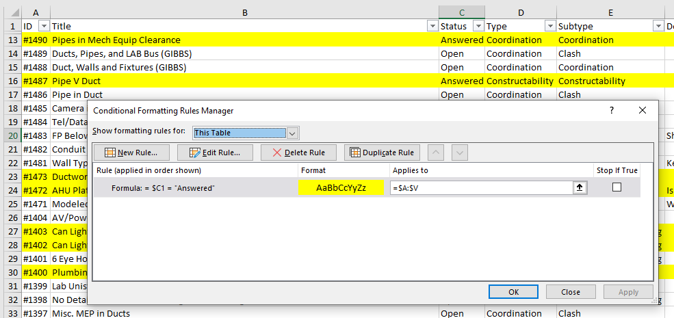

# Excel Techniques Cheat Sheet
###### Ballinger - D. Howard & Friends - March 20, 2024

## Autofill

#### Autofill same cell contents:
 - Select one cell, grab drag handle at lower right corner, drag to fill.
 - Cells with formulas will copy the formula with updated cell references.

#### Autofill a sequence
 - Fill in first 2 cells with sequence, select both cells, then drag to fill
 - Types of sequences that can be autofilled:
   - Numeric
   - Dates / Days of Week / Months / Times
   - Repeating patterns of text
   - Custom Lists

#### Autofill down to match adjacent column
 - Select one or more cells, horizontally and/or vertically
 - Double-Click the drag handle
 - Excel will autofill to match the size of the adjacent column on the left

#### Right-Click Autofill
 - Right-click and drag the handle to see additional options for numeric series.
   - Linear series
   - Growth series
 - Fill without Formatting also available

#### Define Custom Lists
 - File -> Options -> Advanced -> General section button **`Edit Custom Lists...`**
 - Define a new custom list or edit an existing one.
 - Allows for pre-defined values for autofill as well as custom sorting options (non-alphabetical / non-numeric)

## Keyboard Shortcuts

#### Navigation
 - `Home` - Move to first column of selected row
 - `CTRL-Home` - Move to beginning of worksheet
 - `CTRL-End` - Move to end of worksheet
 - `CTRL-<arrow key>` - Move in specified direction to end of range (next fill/unfilled cell).
 - `CTRL-<mouse wheel>` - Zoom in/out on sheet.

#### Selection
 - `CTRL-A` - Select entire sheet
   - Alternatively, click top corner between col A and row 1
 - `CTRL-SHIFT-*` (asterisk - number 8 key) - Select entire current region.
 - `CTRL-SHIFT-<arrow key>` - Select all cells to end or range (next filled/unfilled cell).
 - Select arbitrary range by selecting one corner, then Shift-click opposite corner

#### Extend/Add Mode
 - `F8` -  enter *Extend Selection* mode.
   - Pressing `<arrow keys>` will progressively add to your selection.
   - Can also click cells to extend to new location.
 - `SHIFT-F8` - enter *Add/Remove Selection* mode
   - Add non-continuous regions to current selection without holding down `CTRL`

## Formulas and Functions

#### Basic formulas
 - Select cell, then type `=` to start a formula. 
 - Select additional cells to add references to those cells in the formula.
   - Can also type in cell references.
 - Press `Enter` to complete the formula.
 - Example: 
   - `= C4 + D4` - adds the contents of cells C4 and D4.
 - Use Autofill as above to extend this formula to more cells in the same column or row.

#### Basic Functions
 - In a formuila, start typing in function name, use arrow keys to select from pop-up menu, then hit `Tab` to autocomplete the function name.
 - Or type the full function name, then open and closed parenthesis `()`, with the arguments to the function inside, separated by commas.
 - Many functions take ranges as arguments - Ex: `= SUM(A1:A10)` sums the values of cells A1 thru A10.
 - See [Microsoft reference docs](https://support.microsoft.com/en-us/office/excel-functions-by-category-5f91f4e9-7b42-46d2-9bd1-63f26a86c0eb) for more info and complete list of functions. 
    - [https://support.microsoft.com/en-us/office/excel-functions-by-category-5f91f4e9-7b42-46d2-9bd1-63f26a86c0eb](https://support.microsoft.com/en-us/office/excel-functions-by-category-5f91f4e9-7b42-46d2-9bd1-63f26a86c0eb)

#### Most Commonly Used Functions
##### Basic
 - `SUM()`
 - `AVERAGE()`
 - `COUNT()`
 - `MAX()`
 - `MIN()`
##### Logical
 - `IF(<logical test>, <result if true>, <result if false>)`
 - `AND(<logical1>, [<logical2>], ...)` - Returns True only if ***ALL*** logical tests are True.
 - `OR(<logical1>, [<logical2>], ...)` - Returns True if ***ANY*** of the logical test are True.
 - `NOT(<logical1>)` - Reverses the logic of the argument - ie returns True if logical test is False, and vice versa.

## Relative and Absolute Addressing
 - Relative - the references in the formula updates to a new cell when autofilling to maintain the relationship between cells.
   - Example: `= C4 + 10` updates to `= C5 + 10` when autofilling down.
 - Absolute - the reference does not update to a new location when autofilling.
   - Indicated by a `$` in front of the row number and/or column letter.
   - Examples: 
     - `= C4 + $A$1` will update to `= C5 + $A$1` when autofilled down.
     - `= C4 + $A1` will udpate to `= C5 + $A2` when autofilled down, but will update to `= D4 + $A1` when autofilled to the right.
 - Use `F4` key to cycle between different options for relative/absolute addressing after entering the cell reference int he formula.

## Referencing between sheets
 - Formulas can be written to reference between sheets by adding the sheet name + `!` before the cell reference.
   - Example:  To reference cell `A1` on sheet `Data`, use `Data!A1`
 - Same rules for relative vs absolute addressing as above apply.

## Naming Cells and Ranges
 - Name a single cell or a range selecting the desired area
 - Click where the cell address is shown on the bottom left of the ribbon.
 - Type in the desired name for the cell / range.
 - When using formulas, you can now refer to those names instead of the cell address.

## Tables and Filters
#### Filters
 - Select range and click `Sort & Filter / Filter`
 - You can now filter or sort the data. 

 #### Tables
 - [Microsoft Tables Documentation](https://support.microsoft.com/en-us/office/overview-of-excel-tables-7ab0bb7d-3a9e-4b56-a3c9-6c94334e492c)
   - [https://support.microsoft.com/en-us/office/overview-of-excel-tables-7ab0bb7d-3a9e-4b56-a3c9-6c94334e492c](https://support.microsoft.com/en-us/office/overview-of-excel-tables-7ab0bb7d-3a9e-4b56-a3c9-6c94334e492c)
 - Tables provide a lot of the same functionality as filtered ranges, but with more powerful functions as well.
 - Calculated columns automatically are applied to all rows.
 - Default names for tables are Table1, etc.  To rename, click anywhere within the table area, then go to the `Table Design`
 - Can refer to the entire table, or just a specific column in a formula or function.
   -

## Conditional Formatting

#### Color entire rows based on value in one column
 - Example below assumes use of a table from column A through column V, and coloring based on value in column C
 - Set applied to area to `= $A:$V`
 - Set formula to `= $C1 = 'Answered'`
 - Formula references row 1, but is applied to all rows. 
 - Use of dollar sign `$` is needed to have all columns look to column C, instead of the 2nd column to the right of cell (ie, omitting `$` will only color column A based on value of column C)

 

## Pivot Tables
Courtesy  of Katie Brophy
#### Basic Setup
 - Start with Raw Data
 - Select all Data and “Format as Table”
 - Select any cell within table -> Insert pivot table
 - View field list - This is how to add hierarchy to your table
   - Rows - Select broadest categories first to organize list, such as location, building name etc, then you can play with different permutations
   - Filters - This allows you to add a filter category at the top of your table. So you can view a specific category in a single table. Such as only classrooms or only floor 1.
   - Values - Best use of it is to count (will count every cell with something in it) or sum (will add up things such as area) - you can change which ‘value’ excel is looking for by clicking and editing the “value field settings’
#### Tips
 - If you you raw data changes, you will need to refresh your data
 - Pivot table analyze - data - refresh
 - I like to play with the report layout to view the pivot table in different ways.
 - Design - layout - report layout
 - I prefer tabular form, and use the pivot table styles to add hierarchy to the table designs

## Importing data from other files
 - Data tab -> Get Data -> from File
 - Allows options for maintaining data formatting when importing from CSV or other text file.
   - Revit exported data
   - Exports from other programs

## Excel on Teams / Sharepoint